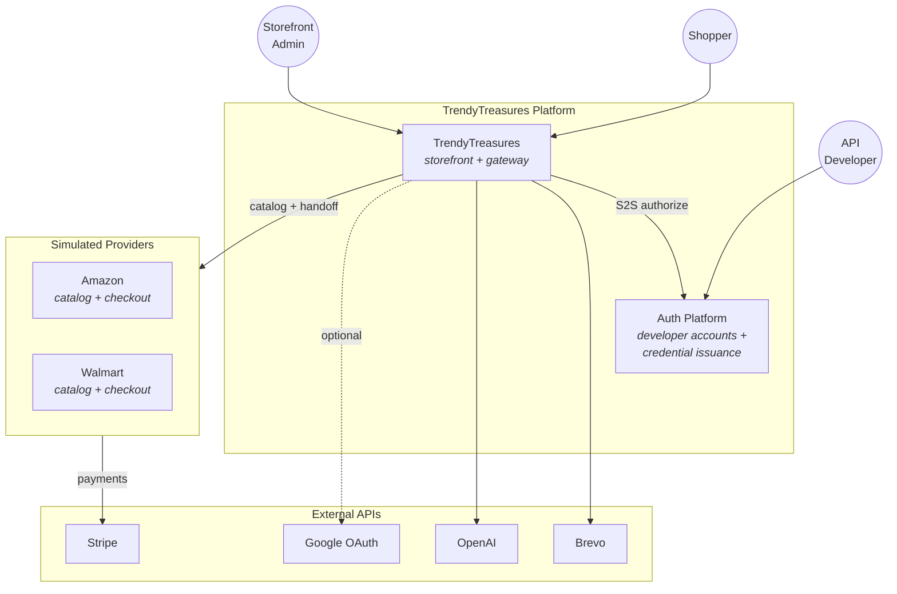
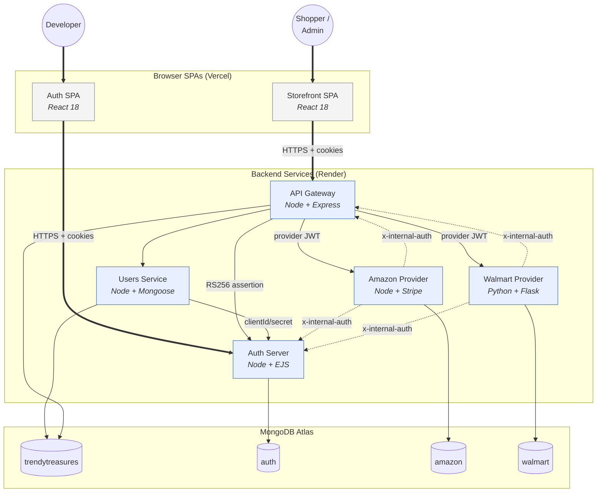
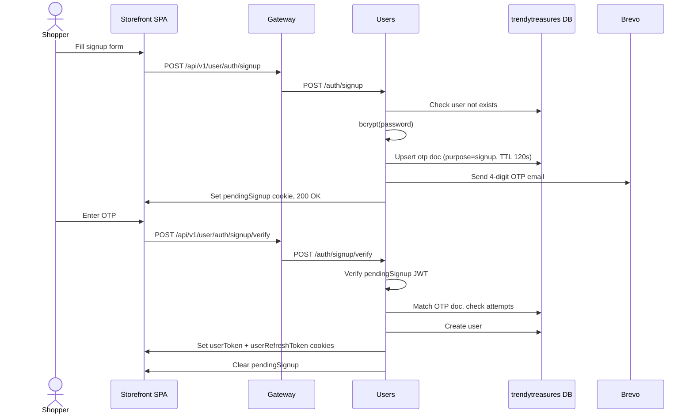
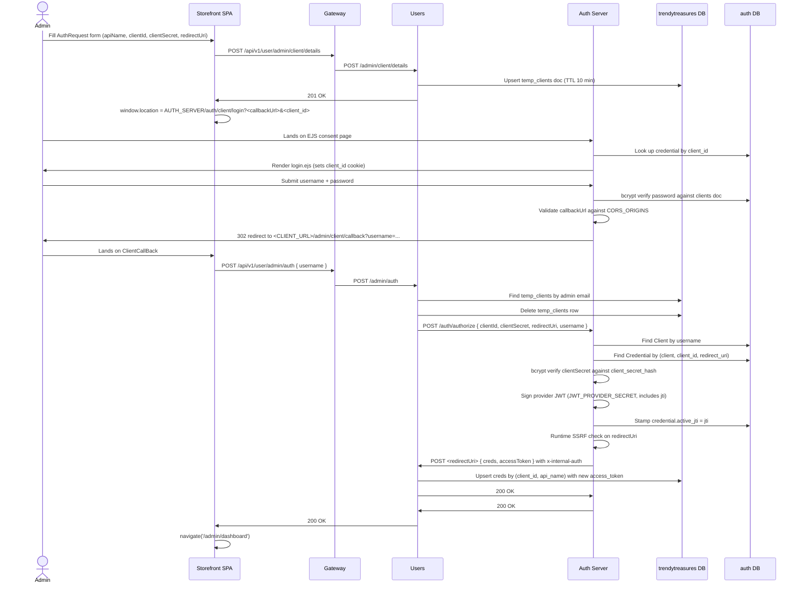
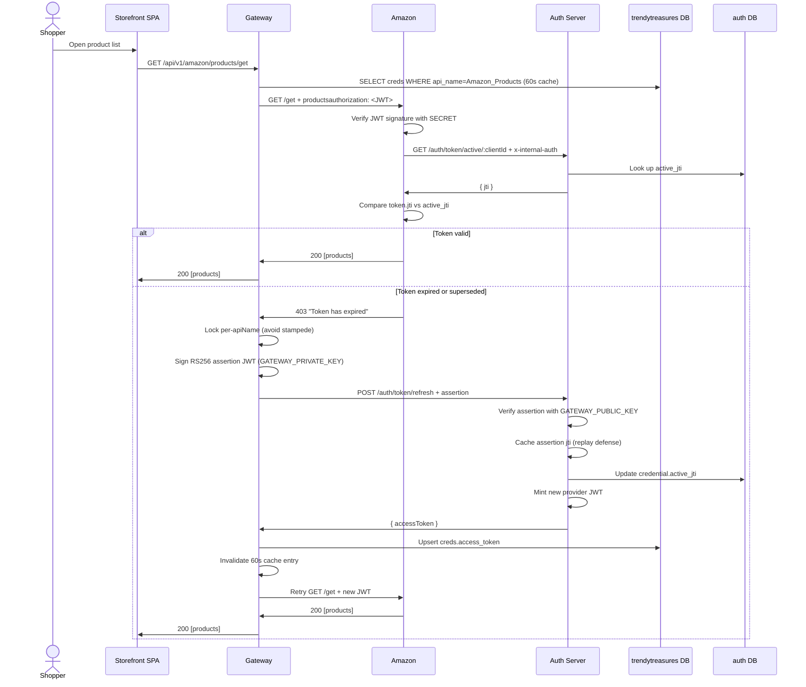
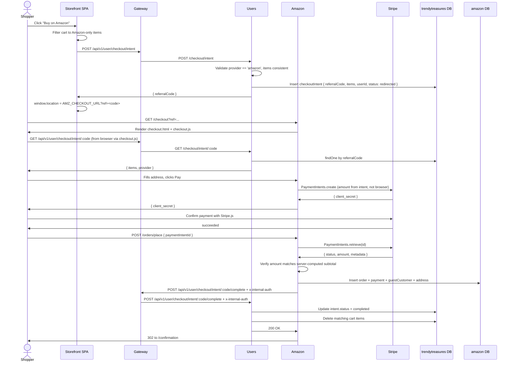
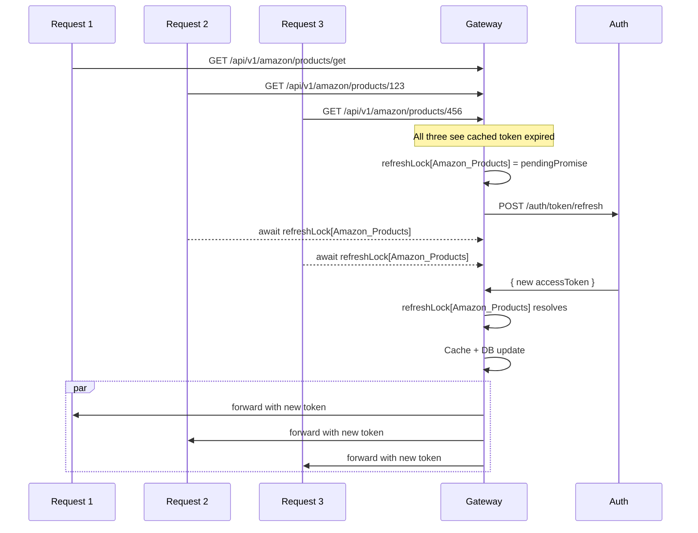
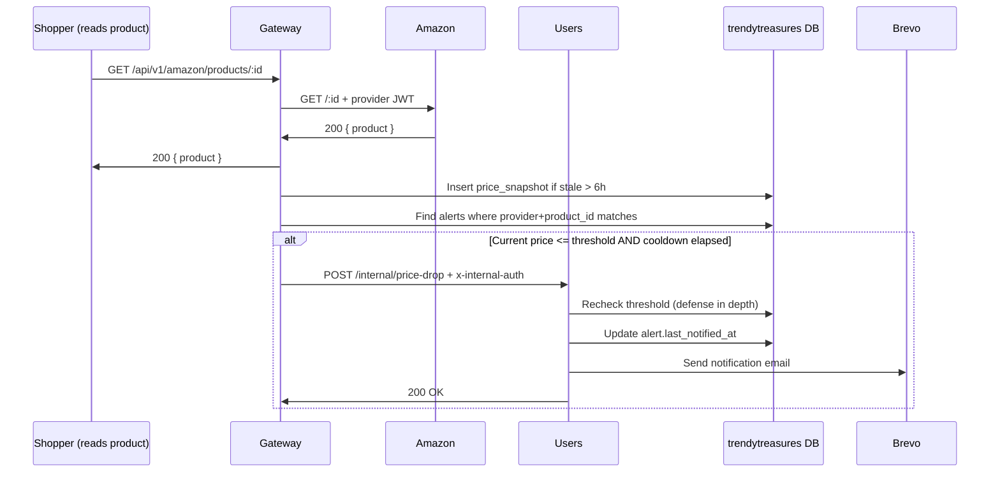
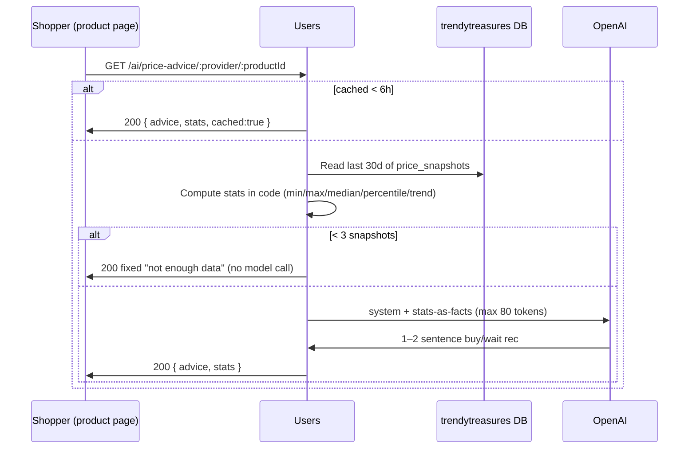
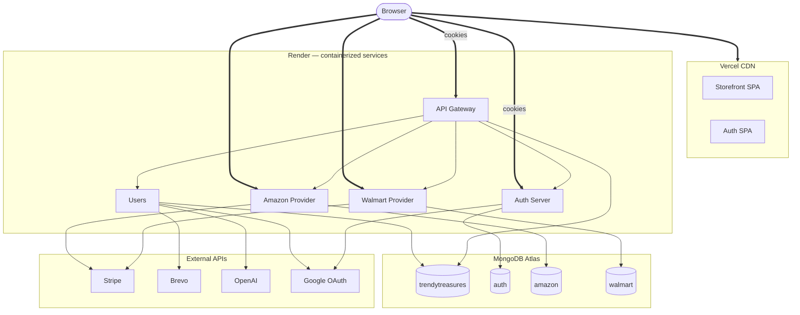

# Architecture

> What the system looks like, why it's put together this way, and what each piece is responsible for.

## Table of contents

1. [System context (the big picture)](#1-system-context-the-big-picture)
2. [Container view (one level deeper)](#2-container-view-one-level-deeper)
3. [The main flows, as sequence diagrams](#3-the-main-flows-as-sequence-diagrams)
4. [Service cards](#4-service-cards)
5. [Concerns that touch every service](#5-concerns-that-touch-every-service)
6. [Deployment topology](#6-deployment-topology)

---

## 1. System context (the big picture)

TrendyTreasures is an aggregator. Shoppers see a single catalog, but the products actually come from two simulated providers (Amazon and Walmart). When a shopper is ready to buy, TrendyTreasures sends them over to the provider's own checkout — the provider runs the payment, takes the order, and stores the PII. TrendyTreasures itself never holds payment details or full customer records.

### Why this shape?

The aggregator-with-handoff design is better than two natural alternatives:

| Alternative | Why we don't do it | What we do instead |
|---|---|---|
| TrendyTreasures handles checkout itself | We'd be on the hook for PCI compliance, we'd be storing provider customer PII, and we'd be liable for transactions on someone else's catalog. That doesn't match the "aggregator" idea. | We create a referral code and send the browser to the provider's checkout. The provider owns the transaction. |
| TrendyTreasures copies the entire provider catalog into its own database every night | Data gets stale; inventory might be wrong at checkout. | We read product data through the gateway live (with a 60-second token cache) and save per-product price snapshots for history. |

---

## 2. Container view (one level deeper)

The platform is made up of **seven** deployable pieces, split across three trust domains. The gateway is the only public entry point for the storefront's API traffic — everything behind it is internal.

**Reading the diagram.** Solid arrows are normal request-path traffic. Dashed arrows are internal callbacks protected by `x-internal-auth`.

### How services authenticate to each other

| Caller → Callee | How | Notes |
|---|---|---|
| Browser → Gateway | Cookie session + CSRF | `SameSite=None; Secure` in production, since the SPA and API are on different domains |
| Gateway → Users | None today (private network would be ideal) | The gateway is fully trusted upstream of Users |
| Gateway → Amazon/Walmart | `productsauthorization: <provider-JWT>` | Token cached for 60s on the gateway |
| Gateway → Auth (token refresh) | RS256 assertion JWT (RFC 7523) | Gateway has the private key; Auth has only the public key |
| Users → Auth (authorize) | Plain `clientId` + `clientSecret` | One-shot during the admin authorize flow |
| Amazon/Walmart → Auth (introspect) | `x-internal-auth` header | Shared secret |
| Amazon/Walmart → Gateway (complete checkout) | `x-internal-auth` header | Same shared secret |
| GH Actions → Gateway (snapshot sweep) | `x-internal-auth` header | Optional scheduled job |

---

## 3. The main flows, as sequence diagrams

Six flows are worth tracing end to end. Each diagram below maps directly to the code, and line references appear next to each step.

### 3.1 Shopper signup (with email OTP)

The signup is split into two steps because we **never want a user row in MongoDB unless the email has been verified**. If we created the row first, abandoned signups would pile up and we'd have to clean them later. Doing it this way means an unverified OTP just expires (the `otp` collection has a 120-second TTL), and no `users` document is ever created.

### 3.2 Admin → Auth provider authorization (the OAuth-style flow)

This is the trickiest flow in the system. It exists because the gateway needs a long-lived provider JWT to use when calling Amazon and Walmart, but that JWT must never touch the browser.

A few things worth pointing out:

- The `temp_clients` row has a **10-minute TTL** on `created_at`. If the admin takes longer than that (say, debugging a deployment), MongoDB silently deletes the row and the next `/admin/auth` call returns 404. This is a deliberate but slightly brittle safety net — see [Users/Models/Client.js:23-27](../Users/Models/Client.js#L23-L27).
- The `redirect_uri` does **double duty**: it's both the browser callback origin (validated in `OAuthLoginController`) and the server-to-server callback target (where Auth POSTs the token).
- `active_jti` is how we revoke tokens. Every authorize generates a new `jti`. Provider services compare the incoming token's `jti` against the credential's current `active_jti` and reject anything stale.

### 3.3 Loading a product (with a transparent token refresh)

The gateway holds provider tokens; the browser never sees them. If a provider rejects a token because it expired, the gateway refreshes and retries automatically.

Three properties worth calling out:

1. **The browser never sees the refresh.** The shopper never sees a 403 — they get products on the first try, even when the cached token was already expired.
2. **No refresh stampede.** If 50 product requests come in at the same time and they all see an expired token, only one refresh actually runs. The other 49 wait for it.
3. **Asymmetric trust.** Auth only has the public key, so even if someone breaks into Auth's environment, they still can't sign new assertions — they'd need the private key, which only lives on the gateway.

### 3.4 Checkout handoff to the provider

The key security property here: **the buyer's browser never tells the provider how much to charge**. The amount in the PaymentIntent is recomputed on the server from the trusted `checkoutIntent.items` (which TrendyTreasures created and the provider read through the gateway). Even if someone tampers with the browser, they can't pay less than they owe.

### 3.5 How we prevent a token-refresh stampede

The gateway keeps an in-memory map of in-flight refreshes, keyed by `apiName`. If many product requests all see an expired token at the same time, they share a single refresh call.

This works inside a single process. If you run multiple gateway instances, each one will still refresh once per expiry window — fine for a 1-hour TTL (worst case is N instances refreshing once per hour). If you need tighter sharing across instances, put the refresh lock and token cache in Redis.

### 3.6 Price drop notification

Two reasons we run this in the gateway, not in Users:

1. The gateway already has the product response in hand — saving a snapshot there avoids reading the product a second time.
2. Snapshotting piggybacks on existing reads instead of being a separate scheduled job. Less code, same result.

For products that have alerts but nobody's looked at lately, there's a cron-driven `POST /internal/snapshot-tracked` that sweeps them on a schedule.

### 3.7 AI price advisor & product Q&A

Two small AI features live in the Users service and read the **same** `price_snapshots` the chart is built from.

Design choices worth knowing:

1. **The math is done in code, not by the model.** `summarizeHistory()` computes min/max/median/percentile/trend and hands them to the model as *facts*. The model only phrases the buy-or-wait call — it can't get the arithmetic wrong, and the prompt stays short and cheap.
2. **Cheap-path short circuits.** A 6h in-memory cache and a "< 3 snapshots → skip the model" rule mean most reads never hit OpenAI.
3. **Q&A is grounded.** Product Q&A answers strictly from the supplied listing and is told to say "I don't see that detail" rather than invent one (see SECURITY.md §4 → AI endpoint guardrails).
4. **Self-disabling.** No `OPENAI_API_KEY` → endpoints return `503` → the storefront widgets render nothing. The feature is effectively a flag flipped by the presence of the key.

---

## 4. Service cards

Each service in one page: what it does, key files, dependencies, and things to watch out for.

### 4.1 API Gateway (`APIGateway/`)

**What it does:** the only public API surface for the storefront. Proxies requests to internal services, injects provider tokens on product reads, refreshes upstream JWTs when they expire, and captures price snapshots.

**Entry point:** [APIGateway/app.js](../APIGateway/app.js)

**Key files:**
- `app.js:546-549` — `/api/v1/user/*` proxy (rewrites the prefix, forwards to Users).
- `app.js:561-562` — `/api/v1/amazon/products*` and `/api/v1/walmart/products*` with token injection.
- Provider token cache (60s TTL) — an in-memory map keyed by `apiName`.
- Refresh lock — an in-memory `Map<apiName, Promise>`.

**What it doesn't own:**
- No user database. The gateway reads from `creds` in the `trendytreasures` database, but doesn't write user state.
- No business logic. Pure routing + cross-cutting concerns.

**Production env requirements:** RSA private key (`GATEWAY_PRIVATE_KEY`), upstream URLs, `INTERNAL_AUTH_SECRET`, Mongo connection string. The service refuses to start if any of these are missing in production.

**Things to watch out for:**
- The token cache is per-instance. If you scale horizontally, each instance refreshes independently.
- Because of the 60-second cache, credential rotation takes up to 60 seconds to fully propagate. To force it, call `DELETE /internal/token-cache/:apiName`.

### 4.2 Users (`Users/`)

**What it does:** owns all shopper and admin state — cart, checkout intents, account lifecycle, price alerts, AI endpoints.

**Entry point:** [Users/app.js](../Users/app.js)

**Collections it owns in the `trendytreasures` database:**
- `users` (shoppers + admins, distinguished by `role`)
- `cart`
- `checkoutIntent`
- `otp` (TTL 120s)
- `temp_clients` (TTL 600s)
- `creds` (shared with the gateway — gateway reads, Users writes)
- `price_alerts`, `price_snapshots` (also shared — gateway writes snapshots, Users reads alerts)

**Trust boundary:** Users trusts the gateway. It doesn't strictly check `Origin` because the gateway is its only public caller. Internal POSTs to `/internal/*` and `/checkout/intent/:code/complete` carry `x-internal-auth`.

**Things to watch out for:**
- Global CSRF middleware runs before routes (see [Users/app.js:139](../Users/app.js#L139)). Internal POSTs that don't have a CSRF cookie pair would normally be rejected, but the CSRF middleware short-circuits when there's no session cookie. That's a bit fragile — see [`SECURITY.md` section 6](SECURITY.md) for the recommended fix.
- `/admin/auth` deletes the `temp_clients` row **before** the upstream `/auth/authorize` call returns. If that upstream call fails (e.g. a brief network issue), the admin has to start over.

### 4.3 Auth server (`Auth/server/`)

**What it does:** identity provider for **developers** (not shoppers), and the issuer of provider JWTs.

**Entry point:** [Auth/server/app.js](../Auth/server/app.js)

**Collections in the `auth` database:**
- `clients` (developer accounts, separate from `users`)
- `credentials` (API credentials owned by a developer; carries the bcrypt-hashed `client_secret_hash`)
- `authOtp` (TTL 600s, hashed OTPs for signup and recovery)

**Two trust boundaries it bridges:**
1. **Developer → Auth:** standard session-cookie auth with CSRF, refresh tokens that carry `tokenVersion` for invalidation.
2. **Gateway → Auth (token refresh):** RS256 assertion JWT (RFC 7523 bearer profile). Auth has the public key; the gateway has the private key.

**Important controllers:**
- [Auth/server/Controllers/ClientAuthorizationController.js](../Auth/server/Controllers/ClientAuthorizationController.js) — handles both `/auth/authorize` (S2S with client credentials) and `/auth/token` (browser-authed). Signs provider JWTs with `JWT_PROVIDER_SECRET`.
- [Auth/server/Controllers/TokenRefreshController.js](../Auth/server/Controllers/TokenRefreshController.js) — verifies the gateway's RS256 assertion, signs a new provider JWT, rotates `active_jti`.
- [Auth/server/Controllers/TokenIntrospectController.js](../Auth/server/Controllers/TokenIntrospectController.js) — `GET /auth/token/active/:clientId` returns the current `active_jti`. Used by Amazon/Walmart to check if a token has been revoked.

**The EJS consent page:** [Auth/server/Views/login.ejs](../Auth/server/Views/login.ejs) is server-rendered because the SPA-to-SPA OAuth flow needs a same-origin form submission. The form POSTs to `/auth/client/login`, which validates the callback against `CORS_ORIGINS` and 302-redirects back to the storefront. The CSP `form-action` directive requires the storefront origin in `FORM_ACTION_ORIGINS`; see [Auth/server/.env.example:36-40](../Auth/server/.env.example#L36-L40).

### 4.4 Amazon provider (`Amazon/`)

**What it does:** simulates an upstream provider. Owns products, addresses, orders, and payments. Runs the Amazon-branded checkout pages.

**Entry point:** [Amazon/app.js](../Amazon/app.js)

**Two distinct surfaces:**
1. **Authenticated product API** (`/get`, `/:productId`) — requires `productsauthorization: <provider-JWT>`. Verified locally with `SECRET`; live `jti` check against Auth's introspection endpoint.
2. **Public checkout pages** (`/checkout`, `/confirmation`, `/payments/create-intent`, `/orders/place`) — meant for the browser after the handoff. The referral code is the capability.

**Provider JWT verification, step by step:**
1. Verify the signature using `SECRET` (which must equal Auth's `JWT_PROVIDER_SECRET`).
2. Check that the `api_url` claim matches the `x-original-url` header (so an Amazon token can't be used on Walmart).
3. Check that the `jti` claim matches Auth's current `active_jti` for that credential (cached 30s per `clientId`).

### 4.5 Walmart provider (`Walmart/`)

**Same role as Amazon**, just in a different language (Python/Flask) and ODM (MongoEngine instead of Mongoose). The contract — checkout pages, Stripe integration, provider JWT auth — is intentionally identical so the gateway can treat both providers the same way.

**Entry point:** [Walmart/app.py](../Walmart/app.py)

**Why two languages?** Two providers in two languages is the smallest setup that proves the boundary contracts (HTTP + JWT) really are stack-agnostic, which is the whole point of using microservices.

### 4.6 Storefront SPA (`client/`)

**What it does:** shopper UI + admin UI. React 18 (CRA via CRACO). Talks only to the gateway.

**Entry point:** [client/src/App.js](../client/src/App.js)

**Notable client-side concerns:**
- **CSRF setup:** [client/src/utils.js](../client/src/utils.js) wraps `fetch` in a helper called `apiFetch`. It fetches a CSRF token from `GET /api/v1/user/csrf-token` before the first state-changing request, captures any rotated tokens from response bodies, and retries with a fresh token if a request returns 403.
- **Refresh on 401:** `apiFetch` watches for 401s, calls `POST /api/v1/user/auth/refresh`, and retries the original request once.
- **Guest cart:** users who aren't logged in get a cart stored in `localStorage`. When they log in, it's merged into the server cart.
- **Two cookie domains:** the storefront SPA lives on Vercel (`*.vercel.app`) and the API lives on Render (`*.onrender.com`). These are different registrable domains, so `document.cookie` can't read the CSRF cookie. To work around that, the server also returns the token in the response body, and `apiFetch` caches it in memory.

### 4.7 Auth SPA (`Auth/client/`)

**What it does:** developer UI for registering a client account and creating, rotating, or deleting API credentials. Talks only to the Auth server.

**Entry point:** [Auth/client/src/App.js](../Auth/client/src/App.js)

This is the surface a developer uses **before** a TrendyTreasures admin authorizes their credentials. It's purely Auth-domain — no storefront access.

---

## 5. Concerns that touch every service

### 5.1 Authentication strategy

| Domain | Session cookies | Refresh mechanism | How refresh tokens get killed |
|---|---|---|---|
| Shopper (Users) | `userToken` (1h) + `userRefreshToken` (7d) | Both rotated on each refresh | None — relies on TTL |
| Admin (Users) | `adminToken` + `adminRefreshToken` | Same as shopper | None — relies on TTL |
| Developer (Auth) | `authToken` (15m) + `authRefreshToken` (7d) | Both rotated | `tokenVersion` on the `clients` doc — bumped on password change |
| Provider (Amazon/Walmart) | None — uses `productsauthorization: <JWT>` header | RS256-assertion-driven refresh via Auth | `active_jti` on the credential — re-authorize invalidates old tokens |

Three different refresh stories because the threat models are different. See [`SECURITY.md` section 3](SECURITY.md#3-authentication-architecture).

### 5.2 CSRF strategy

We use the **double-submit cookie pattern**, adapted for cross-domain (`*.vercel.app` ↔ `*.onrender.com`):

1. When the SPA starts → `GET /csrf-token` → server sets a `csrfToken` cookie **and** returns the same value in the response body.
2. The SPA caches the body value in memory (because cross-domain code can't read the cookie).
3. State-changing requests send `x-csrf-token: <value>` in the header.
4. The server compares the header to the cookie. They must match.

The CSRF middleware short-circuits when there's no session cookie present, so anonymous endpoints (initial signup, for instance) work without CSRF. As soon as the user has any auth cookie, CSRF becomes mandatory.

### 5.3 CORS strategy

Each service has a strict `CORS_ORIGINS` allowlist with `credentials: true`. The allowlist needs to include:

- The service's **own URL** (browsers send `Origin` even on same-origin POSTs).
- Every browser origin that calls it (storefront, auth client, both checkout pages).

Tradeoff: this means deploying to a new Vercel preview URL requires updating the allowlist. Use Vercel **production aliases** to avoid this — they have stable hostnames.

### 5.4 Rate limiting

Per-service, in-memory rate limits via `express-rate-limit`:

| Surface | Default | Why |
|---|---|---|
| Gateway general | 120/min | Public surface, generous enough for catalog browsing |
| Gateway auth routes | 30 per 15min | Brute-force defense for login/signup/recovery |
| Users general | 120/min | Defense in depth in case the gateway is bypassed |
| Auth server global | 200 per 15min | Developer surface, lower traffic |
| Provider general | 120/min | Mirrors the gateway |
| Provider payments | 20/min | Stripe round-trips cost money if abused |

These limits are **per-instance**. Horizontal scaling effectively multiplies the budget. For real production rate limiting, use Redis or a CDN/WAF layer.

### 5.5 Request correlation

Every request gets an `x-request-id`:
- The first service to see the request generates it (usually the gateway).
- It's forwarded through every server-to-server call.
- Every log line in every service prints it: `[<service>] [<request-id>] <method> <path>`.

To trace a single browser request through all five services, grep for the `x-request-id` value (returned in response headers, visible in DevTools).

---

## 6. Deployment topology

**Reading the diagram.** Bold arrows are browser-originated HTTPS traffic. Thin arrows are server-to-server and database calls.

**Why we picked these hosts:**

- **Vercel for SPAs** — static files on a CDN with instant rollbacks.
- **Render for backends** — one container per service; works the same way for Node and Python.
- **Atlas for data** — managed MongoDB; for real production, lock it down with a network allowlist or VPC peering.
- **Stripe for payments** — test mode in dev; production keys touch real money.
- **Brevo for email** — generous free tier (300/day), works around the fact that Render's free tier blocks outbound SMTP.

**Things we'd add for mature production:**

- Redis (or similar) for cross-instance caches — the token cache, refresh lock, AI cache, and active-jti cache.
- A CDN/WAF in front of the gateway (Cloudflare is partially in place via Render).
- Private networking between Render services (right now each service is publicly reachable, with `INTERNAL_AUTH_SECRET` as the only gate).
- A managed secret store (right now secrets are env vars set in the Render dashboard).

For production hardening, the first investments are Redis-backed cross-instance caches, a managed secret store, and private networking between Render services.
