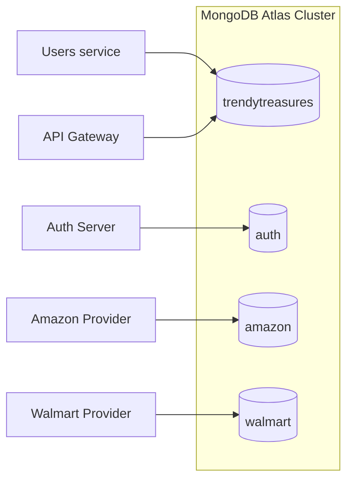
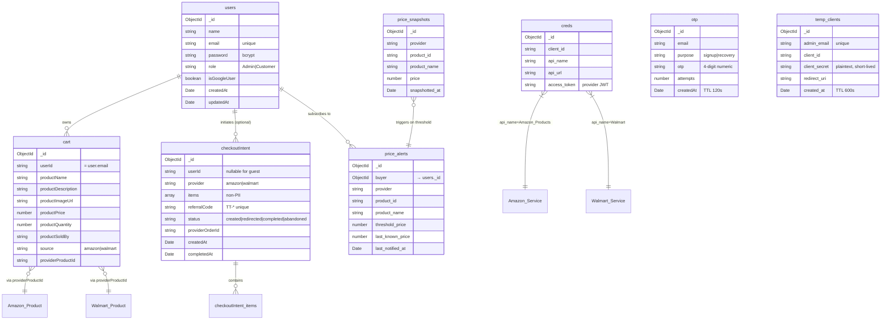
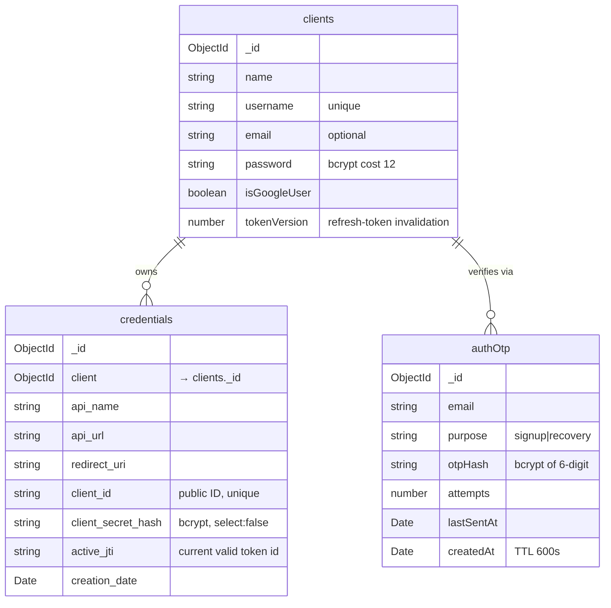
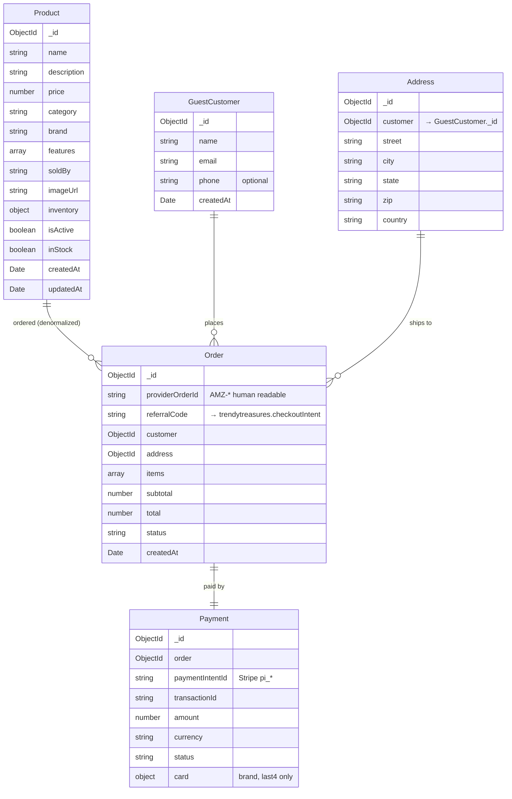

# Data Model

> What we store, where we store it, and why each collection is shaped the way it is.

## Table of contents

1. [Database boundaries](#1-database-boundaries)
2. [`trendytreasures` database (Users + Gateway)](#2-trendytreasures-database-users--gateway)
3. [`auth` database (Auth server)](#3-auth-database-auth-server)
4. [`amazon` database](#4-amazon-database)
5. [`walmart` database](#5-walmart-database)
6. [Index summary](#6-index-summary)
7. [Cross-database references](#7-cross-database-references)

> **A note on the name `trendytreasures`.** In the actual code and connection strings, the first database is still named `ecommerce` (that's what `MONGO_CONN` points at). These docs call it `trendytreasures` so the database name matches the product name. It refers to the same physical database — just a logical rename in the documentation.

---

## 1. Database boundaries

There are four logical databases, usually all on one Atlas cluster. The boundaries are enforced **by the application**, not by Atlas — each service connects with a different `MONGO_CONN` string pointing at a different database.



### Why split it this way?

| Database | Trust domain | What lives here |
|---|---|---|
| `trendytreasures` | Shopper / admin | Identity, cart, intents, **shared with gateway**: provider tokens, price tracking |
| `auth` | Developer | Developer accounts, API credentials, OTPs |
| `amazon` | Provider 1 | Products, orders, payments, customers (provider-owned PII) |
| `walmart` | Provider 2 | Same shape, isolated |

The principle: **each service's database is its own private data, except when two services explicitly share a database** (the gateway and Users share `trendytreasures` for `creds`, `price_snapshots`, and `price_alerts`).

`auth` is deliberately kept separate from `trendytreasures` even though both store users — because the threat models are different (see [`SECURITY.md` section 3](SECURITY.md#3-authentication-architecture)). A compromise of the Users database shouldn't give an attacker access to developer accounts.

---

## 2. `trendytreasures` database (Users + Gateway)



### What each collection is for

#### `users`
Shoppers and admins share one collection, distinguished by `role`. This is simpler than two collections, and the admin role check is just an extra index lookup at auth time. The `isGoogleUser` flag relaxes the `password` requirement for Google-only accounts.

#### `cart`
Owned by a user (`userId = user.email`). We store `productSoldBy` and `source` so the storefront can group items by provider for checkout without re-fetching product metadata. `providerProductId` is the back-reference into the provider's catalog — needed for fresh price re-fetches at checkout.

#### `checkoutIntent`
The handoff record. Has **no PII** by design — the provider sees only product references and quantities. The `referralCode` is the **capability token**: anyone holding a valid code can read the intent (the `GET /checkout/intent/:referralCode` endpoint is intentionally public). Because there's no PII in the intent, this is safe.

Status state machine:
```
created → redirected → completed
                    └→ abandoned (manual or via sweep)
```

#### `otp`
Short-lived (TTL 120s) numeric OTPs for signup and recovery. The compound unique index on `(email, purpose)` means a second signup attempt for the same email **updates** the existing row rather than inserting a new one — that's what prevents OTP spam.

#### `temp_clients`
A staging row for the admin authorize flow. The 10-minute TTL is intentional: it forces the admin to complete the OAuth-style flow promptly. Downside: long debug sessions can lose the row (see [`SECURITY.md` G5](SECURITY.md#g5--temp_clients-is-deleted-before-the-upstream-call-confirms)).

#### `creds`
**Shared between Users and the gateway.** Users writes here on `/admin/auth/callback`; the gateway reads here on every product request. The compound unique index on `(client_id, api_name)` means a given credential can only be authorized once for a given API at a time — re-authorization upserts and rotates `access_token`.

#### `price_alerts` + `price_snapshots`
**Also shared with the gateway.** The gateway writes snapshots on product reads and reads alerts to decide when to notify. Users reads snapshots for the history endpoint and processes alerts via `/internal/price-drop`.

`price_snapshots` is the time-series collection — denormalized for fast reads on `{provider, product_id, snapshotted_at: -1}`. `price_alerts` has a unique compound index on `(buyer, provider, product_id)` — one alert per shopper per product.

---

## 3. `auth` database (Auth server)



### What each collection is for

#### `clients`
Developers — fully separate from `users`. `tokenVersion` is the refresh-token invalidation primitive — bumping it on password change kills every outstanding session for that developer.

#### `credentials`
Owned by a `client` (developer). The compound unique index on `(client, api_name)` means each developer can only have one credential per API (e.g. one for `Amazon_Products`, one for `Walmart`).

`client_secret_hash` uses `select: false` in the Mongoose schema, so it never accidentally shows up in API responses. The `/authorize` flow uses `.select('+client_secret_hash')` to bring it back when needed for bcrypt comparison.

`active_jti` is the revocation primitive. Every `/authorize` or `/token/refresh` generates a new `jti`, writes it here, and embeds the same value in the JWT it issues. Provider middleware compares the incoming `token.jti` against `credentials.active_jti` (via the introspection endpoint, cached 30s).

#### `authOtp`
**OTPs are hashed here**, unlike Users' OTPs which are stored as plaintext numbers. Why the difference? The developer surface is more sensitive — a developer with credential rotation rights is one step away from minting provider tokens. Hashing makes a DB compromise less useful: an attacker would have to bcrypt-crack the OTP, and the 10-minute TTL would expire long before they could.

---

## 4. `amazon` database



### Notes on provider-owned data

- **`GuestCustomer`** is a deliberate name — the provider treats every checkout as a guest checkout. The provider has no concept of a "TrendyTreasures user" beyond the referral code. The PII collected at checkout (name, email, address) belongs to the provider, not to TrendyTreasures.
- **`Order.referralCode`** is the back-reference to TrendyTreasures' `checkoutIntent`. After a successful order, the provider POSTs the `referralCode` to TrendyTreasures' `/checkout/intent/:code/complete` to close the loop.
- **`Payment.card`** only stores the `brand` and `last4` — Stripe handles the raw card data, so the provider never sees the full PAN.

---

## 5. `walmart` database

The Walmart provider mirrors the Amazon shape almost exactly. Collection names are prefixed (`Walmart_Products`, `Walmart_Orders`, etc.) because MongoEngine pluralizes and cases names differently from Mongoose, and these names are explicit in the model class declarations.

The schemas are intentionally identical to Amazon's so the gateway can treat both providers as interchangeable from the storefront's point of view. The differences are:

| Field convention | Amazon (Mongoose) | Walmart (MongoEngine) |
|---|---|---|
| Snake vs camel case | `soldBy`, `imageUrl` | `sold_by`, `image_url` |
| Inventory shape | Nested object | Embedded list |
| Timestamps | Automatic via Mongoose `timestamps: true` | Manual `created_at` / `updated_at` |

The gateway's response transformer hides these differences so the storefront SPA doesn't have to know. See [APIGateway/app.js](../APIGateway/app.js), in the product-proxy section.

---

## 6. Index summary

| Collection | Index | Type | Purpose |
|---|---|---|---|
| `users.email` | `{email: 1}` | unique | Login lookup |
| `cart` | `{userId: 1, productName: 1}` | (implicit via the findOne pattern) | Cart item lookup on add/update/remove |
| `checkoutIntent.referralCode` | `{referralCode: 1}` | unique, indexed | Provider checkout page lookup |
| `otp` | `{email: 1, purpose: 1}` | unique | One OTP per purpose at a time |
| `otp.createdAt` | `{createdAt: 1}` | TTL 120s | Auto-cleanup |
| `temp_clients.admin_email` | `{admin_email: 1}` | unique | One staging row per admin |
| `temp_clients.created_at` | `{created_at: 1}` | TTL 600s | Auto-cleanup |
| `creds` | `{client_id: 1, api_name: 1}` | unique compound | Gateway token lookup on every product request |
| `price_alerts` | `{buyer: 1, provider: 1, product_id: 1}` | unique compound | One alert per buyer per product |
| `price_snapshots` | `{provider: 1, product_id: 1, snapshotted_at: -1}` | compound | History range queries |
| `clients.username` | `{username: 1}` | unique | Developer login |
| `credentials` | `{client: 1, api_name: 1}` | unique compound | One credential per developer per API |
| `credentials.client_id` | `{client_id: 1}` | unique | Public-ID lookup |
| `authOtp.createdAt` | `{createdAt: 1}` | TTL 600s | Auto-cleanup |
| `Amazon.Product` / `Walmart.Product` | `_id` only | default | Catalog reads |
| `Amazon.Order.providerOrderId` | `{providerOrderId: 1}` | unique | Human-readable lookup |
| `Amazon.Order.referralCode` | `{referralCode: 1}` | indexed | Back-reference to the TrendyTreasures intent |

If you ever notice slow queries, the most likely missing index is on `Order.referralCode` for retroactive lookups during incident response.

---

## 7. Cross-database references

Some foreign keys span databases. The application maintains them; MongoDB doesn't enforce them.

| Reference | From | To | Maintained by |
|---|---|---|---|
| `cart.providerProductId` | `trendytreasures.cart` | `amazon.products._id` or `walmart.products._id` | The storefront when adding to cart |
| `checkoutIntent.items[].providerProductId` | `trendytreasures.checkoutIntent` | provider products | The storefront on intent create |
| `checkoutIntent.referralCode` ⇄ `Order.referralCode` | both directions | linked by string value | The provider on order create; Users on intent update |
| `creds.client_id` | `trendytreasures.creds` | `auth.credentials.client_id` | Auth on the `/authorize` callback |
| `price_alerts.product_id` | `trendytreasures.price_alerts` | provider product `_id` (as string) | The storefront on alert create |

If any of these references go stale (e.g. a provider product is deleted), the application handles it gracefully:
- Cart with a stale product → the SPA shows "Product unavailable" on cart render.
- Intent with a stale product → checkout subtotal recomputation rejects it; the user starts over.
- Alert with a stale product → no snapshots arrive, and the alert quietly does nothing.

There are no cascade deletes — MongoDB doesn't support them, and we don't simulate them. Cleanup is on the operator: orphaned alerts and intents can be swept manually.
